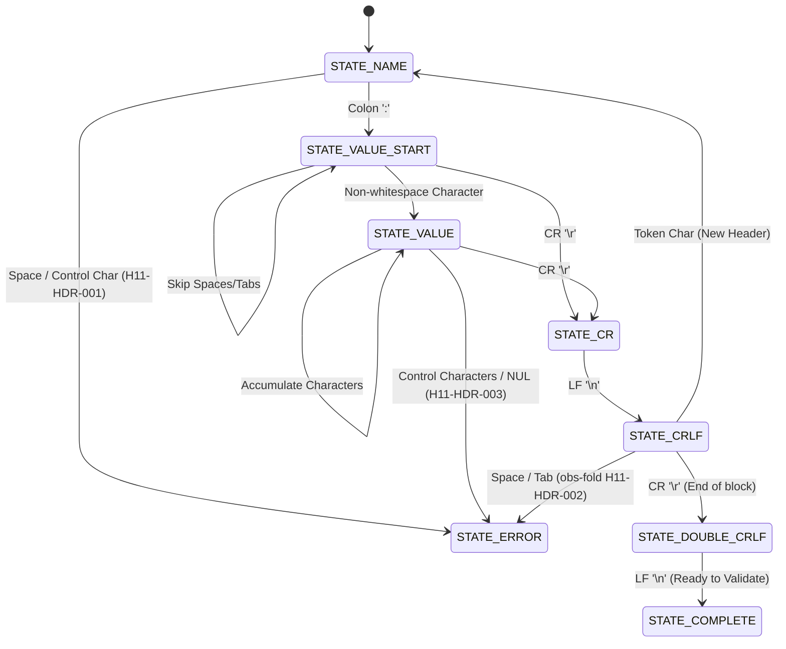

# Evolution of HTTP Header Parsing: Stateful FSM vs. Naive String Scanning

This analysis contrasts the old string-scanning methods (`parse_header` and `parse_http_request`) with the new stateful, RFC-compliant parser implementation in **Kinetic**.

---

## 1. Architectural & Safety Comparison

| Feature | Old Code (`parse_header` / `parse_http_request`) | Current Code (`ktc_header_parser_feed` / `resolve_and_validate`) |
| :--- | :--- | :--- |
| **Parsing Model** | **Blocking / Line-by-Line**: Scans slices in a contiguous buffer searching for boundaries. | **Stateful Incremental FSM**: Feeds bytes incrementally, maintaining parsing boundaries across network packets. |
| **TCP Fragmentation** | **Broken**: If a header line is split across packet borders (e.g. `User-Age` and `nt: curl`), it fails. | **Safe**: Resumes parsing name/value states seamlessly without buffer fragmentation issues. |
| **Delimiter Validation**| **Lenient**: Searches for `:` and skips spaces. `Host : value` (space before colon) is accepted. | **Strict**: Space before colon triggers immediate `400 Bad Request` state (`H11-HDR-001`). |
| **Obsolete Line Folding**| **Ignored**: Fails or gets corrupted if client sends multiline obsolete line folding (`obs-fold`). | **Enforced**: Detects tabs or spaces following a line boundary and rejects immediately (`H11-HDR-002`). |
| **Host Header Invariants**| **Ignored**: Doesn't check if `Host` is missing, duplicated, or overridden by absolute URIs. | **Guarded**: Validates Host presence, rejects duplicate Hosts (`H11-HOST-001`), and extracts Host from absolute targets (`H11-HOST-002`). |
| **Header Section Limit** | **None**: Continues parsing headers up to `MAX_HEADERS`, susceptible to memory exhaustion if lines are long. | **Capped**: Enforces `16KB` size limit for the entire header block (`431 Request Header Fields Too Large` via `H11-HDR-004`). |

---

## 2. Parsing Lifecycle & State Machine

The FSM processes the header stream byte-by-byte through the following states:



---

## 3. Code Card Comparison (PostSpark Ready)

### Snippet 1: The Old Way (Line Scanning & Unsafe)
```c
// ❌ Old Way: Unsafe buffer slicing & lookup
int parse_header(HTTPHeader *header, const char *line, size_t len) {
    const char *ptr = line;
    const char *end = line + len;

    // Fails on split TCP packets; accepts "Host : val"
    const char *colon = memchr(ptr, ':', end - ptr);
    if (!colon) return -1;
    header->name = (char *)ptr;
    header->name_len = colon - ptr;

    ptr = colon + 1;
    while (ptr < end && isspace(*ptr)) ptr++; // Lenient skip

    const char *crlf = memmem(ptr, end - ptr, "\r\n", 2);
    if (!crlf) return -1;
    header->value = (char *)ptr;
    header->value_len = crlf - ptr;
    return (crlf + 2) - line;
}
```

### Snippet 2: The New Way (FSM Octet Feeding)
```c
//  New Way: Stateful FSM character scanner
bool ktc_header_parser_feed(ktc_header_parser_t *p, const uint8_t *data, size_t len) {
    for (size_t i = 0; i < len; i++) {
        uint8_t c = data[i];
        p->total_headers_size++;
        if (p->total_headers_size > 16384) return error(p, ERR_TOO_LARGE);

        switch (p->state) {
            case STATE_NAME:
                if (c == ':') p->state = STATE_VALUE_START;
                else if (c == ' ' || c == '\t') return error(p, ERR_BAD_SYNTAX);
                break;
            case STATE_CRLF:
                if (c == '\r') p->state = STATE_DOUBLE_CRLF;
                else if (c == ' ' || c == '\t') return error(p, ERR_BAD_SYNTAX); // obs-fold
                break;
        }
    }
    return true;
}
```
